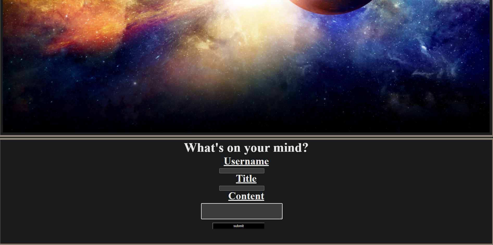
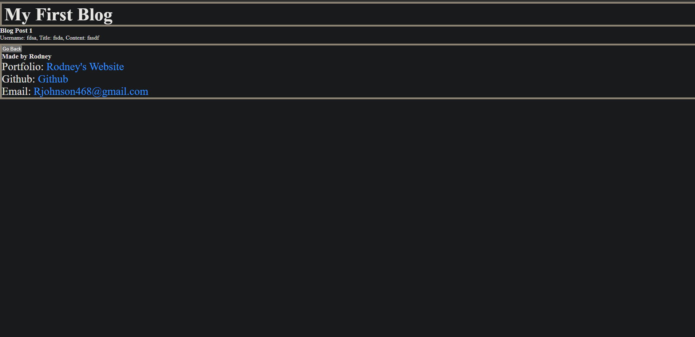

# My-personal-blog

## Description

This webpage is a website that allows for me or someone to keep track of their own post. You are about to write about any topic as long as you are giving a username and title and then the content. After that all of the thoughts from the users will be displayed.

## Installation

N/A

## Usage

The use of this site is to allow a user to post a description or thought on a blog post about what every content that they particularly would like to. It takes the username, title of the content, and the content itself and saves it to the console along with displaying that information on another webpage for you to be able to see all the entries.

## Credits

N/A

## License

MIT License

Copyright (c) 2024 Yllaw0

Permission is hereby granted, free of charge, to any person obtaining a copy
of this software and associated documentation files (the "Software"), to deal
in the Software without restriction, including without limitation the rights
to use, copy, modify, merge, publish, distribute, sublicense, and/or sell
copies of the Software, and to permit persons to whom the Software is
furnished to do so, subject to the following conditions:

The above copyright notice and this permission notice shall be included in all
copies or substantial portions of the Software.

THE SOFTWARE IS PROVIDED "AS IS", WITHOUT WARRANTY OF ANY KIND, EXPRESS OR
IMPLIED, INCLUDING BUT NOT LIMITED TO THE WARRANTIES OF MERCHANTABILITY,
FITNESS FOR A PARTICULAR PURPOSE AND NONINFRINGEMENT. IN NO EVENT SHALL THE
AUTHORS OR COPYRIGHT HOLDERS BE LIABLE FOR ANY CLAIM, DAMAGES OR OTHER
LIABILITY, WHETHER IN AN ACTION OF CONTRACT, TORT OR OTHERWISE, ARISING FROM,
OUT OF OR IN CONNECTION WITH THE SOFTWARE OR THE USE OR OTHER DEALINGS IN THE
SOFTWARE.
